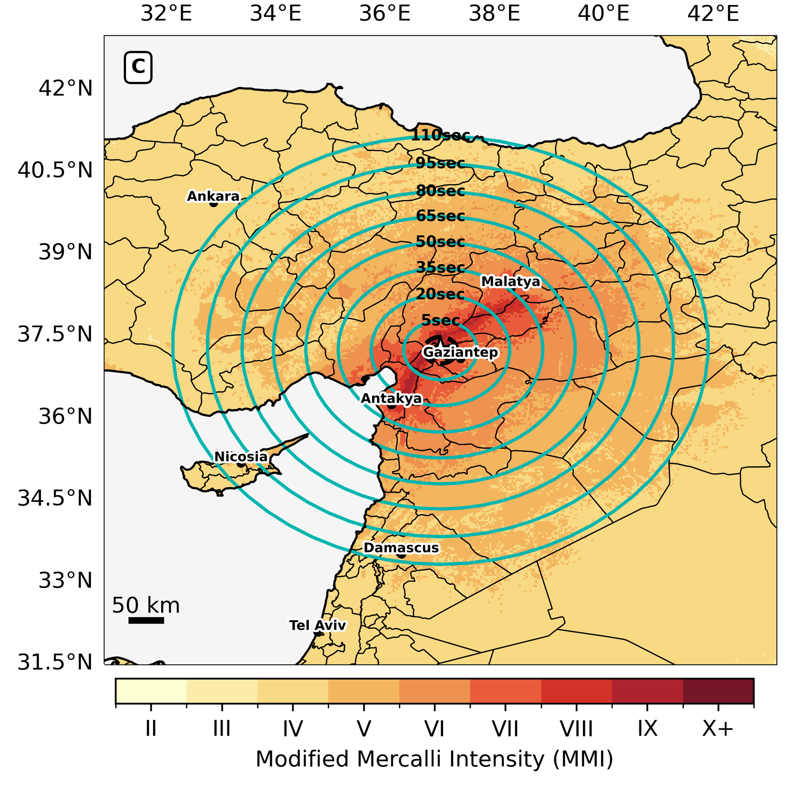

Assessment of the performance of Earthquake Early Warning (EEW) pipelines, in terms of the available warning times to users, is often done without considering the delivery latency of the delivery mechanisms. Recent work (e.g. Patel and Allen, [2022](https://doi.org/10.1785/0220220062); McBride et al., [2023](https://doi.org/10.1016/j.ssci.2022.105898)) has shown that the added latency of common EEW alert delivery mechanisms is non-negligible. Additionally, EEW performance in large strike-slip earthquakes striking near major populations, is somewhat uncalibrated, as no national network-based EEW system has been tested in these conditions.

In this work, we use real-world alert delivery data from the MyShake app, for alerts from the USGS ShakeAlert system delivered to users on the US West Coast, to develop a statistical model for delivery latency. We then combine this model with a replay waveforms from the M7.8 and M7.5 Kahramanmaras earthquake through the EPIC point source algorithm to obtain a source parameter progression, to develop an estimate of available warning times to users in the area, had Turkiye had access to an EEW delivery pipeline similar to what is available on the US West Coast.

*Figure shows interpolated warning time to the first-arriving S-wave, combining the MyShake latency model and the alert progression from EPIC for the M7.8 Pazarcik replay. The MMI felt intensity field is taking from the USGS ShakeMap product.*
